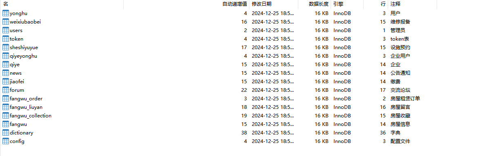

# 一、系统说明

基于springboot+vue+elementui+echarts开发的产业园区智慧公寓管理系统,系统功能齐全, 代码简洁易懂，适合小白学编程。

# 二、系统架构

######      前端：vue| elementui |echarts

######      后端：springboot | mybatis 

######      环境：jdk1.8+ | mysql8.0+ | maven

# 三、代码及数据库

# 四、相关功能介绍

#### 1).客户端

###### 1.登录

###### 2.注册

###### 3.首页

###### 4.房屋信息

###### 5.房屋详情

###### 6.交流论坛

###### 7.公告通知

###### 8.企业列表

###### 9.个人中心

包含:重置、退出登录、更新资料功能

###### 10.个人中心->房屋收藏

###### 11.个人中心->房屋留言

包含:删除留言、查看留言内容功能

###### 12.个人中心->房屋租赁订单

包含：退款、设施预约

###### 13.个人中心->缴费列表

###### 14.个人中心->设施预约

包含:查看、删除、设备维护报备功能

###### 15.个人中心->维修设备

包含:删除、查看功能

###### 2).管理端

###### 1.登录

2.企业注册

###### 3.用户注册

###### 4.个人中心->修改密码

###### 5.管理员信息

包含:详情、删除、修改、查看、新增功能

###### 6.用户管理

包含:详情、删除、查询、新增、重置密码功能

###### 7.企业用户管理

包含:详情、删除、查询、新增、重置密码功能

###### 8.企业管理

包含:新增、修改、删除、详情功能

###### 9.房屋信息管理->房屋信息

包含:详情、删除、查询、修改、新增功能

###### 10.房屋信息管理->房屋留言

###### 11.房屋信息管理->房屋收藏

###### 12.房屋信息管理->房屋租赁订单

###### 13.缴费管理

###### 14.设施预约管理

###### 15.维修设备管理

包含：详情、删除、审核维修

###### 16.交流论坛管理

包含:详情、查看论坛回复、修改、删除帖子

###### 17.公告通知管理

###### 18.轮播图管理

######
